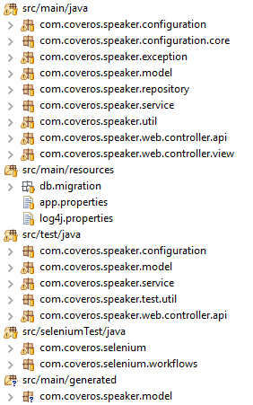

# Dev Journal 
## Throw on your hacker hoodie and lets get to work
# Enterprise-level Java Application Development Checklist

## Basic Considerations
- **Authentication and Authorization:** Secure user access and permissions.
- **Logging and Monitoring:** Track system activities and performance.
- **Database Management:** Optimize queries, use connection pooling, and ensure data integrity.
- **Exception Handling:** Gracefully manage errors for a robust application.
- **Testing:** Implement unit testing for code integrity.
- **Documentation:** Provide clear code comments and user-facing documentation.
- **API Best Practices:** Include pagination, caching, and payload optimization.
- **Security Measures:** Input validation, encryption, and secure communication.
- **Performance Optimization:** Ensure efficient code execution and resource use.
- **Version Control:** Employ a versioning strategy for codebase management.
- **Continuous Integration/Continuous Deployment (CI/CD):** Automate testing and deployment processes.
- **Code Review:** Enforce coding standards and conduct regular code reviews.
- **Scalability Planning:** Prepare for increased loads through load balancing and scalability measures.
- **Microservices Architecture:** Consider breaking down the application into smaller, manageable services.
- **DevOps Practices:** Foster collaboration between development and operations for faster and more reliable releases.
- **Containerization and Orchestration:** Use containers like Docker and orchestration tools like Kubernetes for deployment efficiency.
- **Security Auditing:** Regularly audit and ensure compliance with security standards.
- **Network Security:** Implement measures to secure network communication.
- **Regulatory Compliance:** Adhere to industry-specific regulations and standards.

## Process and Automation
- **Business Process Automation (BPM):** Streamline and automate complex business processes.
- **Content Delivery Networks (CDN):** Optimize content delivery for improved performance.
- **Dependency Management:** Regularly update and manage project dependencies.
- **Identity and Access Management (IAM):** Ensure secure user identity verification and access control.
- **Internationalization and Localization:** Support multiple languages and regions.
- **Data Caching Strategies:** Implement caching mechanisms for improved data retrieval.
- **A/B Testing and Feature Toggling:** Test and control the release of new features.
- **Network and Infrastructure Security Measures:** Secure infrastructure components against threats.
- **Enterprise Search and Indexing Solutions:** Enhance search capabilities within the application.
- **Real-time Analytics and Business Intelligence:** Provide insights into live data for informed decision-making.
- **Change Management:** Implement processes for controlled changes to the application.
- **Vendor Management:** Effectively manage relationships with external vendors.
- **Data Governance and Quality Management:** Ensure data integrity and quality.
- **Enterprise Risk Management:** Identify and mitigate potential risks to the business.
- **Cloud Strategy:** Define and implement a strategy for utilizing cloud services.
- **Disaster Recovery and Business Continuity Planning:** Plan for system failures and ensure continuous business operations.
- **API Gateway:** Centralize API management for improved control and security.
- **Contract-First API Design:** Define API contracts before implementation.
- **Dependency Vulnerability Scanning:** Regularly scan for vulnerabilities in project dependencies.
- **Enterprise Architecture Governance:** Enforce architecture standards across the organization.
- **Multi-Cloud Deployment:** Consider utilizing multiple cloud providers for redundancy and flexibility.
- **Regulatory Compliance Documentation:** Maintain documentation to demonstrate compliance with regulations.
- **Third-Party Integration Strategies:** Integrate external services securely and efficiently.
- **Enterprise-wide Logging and Log Aggregation:** Centralize logs for effective monitoring and troubleshooting.
- **Continuous Testing Strategies:** Extend testing practices beyond unit tests, including integration and performance testing.

## Session Management
- **Session Management:** Implement a secure session management mechanism.
- **Session Security:** Encrypt sessions and protect against session hijacking and fixation attacks.
- **Session Timeout:** Define appropriate session timeout periods for security and user experience.
- **Session Storage:** Choose secure storage options for session data.
- **Token-based Authentication:** Consider using tokens for stateless communication and scalability.
- **Single Sign-On (SSO):** Implement SSO for seamless user authentication across applications.
- **Centralized Session Management:** Centralize session management for consistency in distributed systems.
- **Session Monitoring:** Detect and address anomalies or suspicious activities related to user sessions.
- **Concurrency Control:** Guard against session data inconsistencies due to simultaneous access.
- **Session Logging:** Log relevant session activities for troubleshooting and auditing.
- **Cross-Site Request Forgery (CSRF) Protection:** Protect against CSRF attacks compromising session integrity.
- **Session Revocation:** Provide mechanisms to revoke or invalidate sessions on logout or security incidents.

## Expected Project Structure
> - 